# 🏗️ Business Services Hub - Architecture Diagrams

## 📋 Table of Contents

1. [System Architecture Overview](#system-architecture-overview)
2. [Database Schema](#database-schema)
3. [API Flow Diagram](#api-flow-diagram)
4. [Security Architecture](#security-architecture)
5. [User Journey Flow](#user-journey-flow)
6. [Deployment Architecture](#deployment-architecture)
7. [Component Architecture](#component-architecture)

---

## 🎯 System Architecture Overview

### High-Level System Architecture

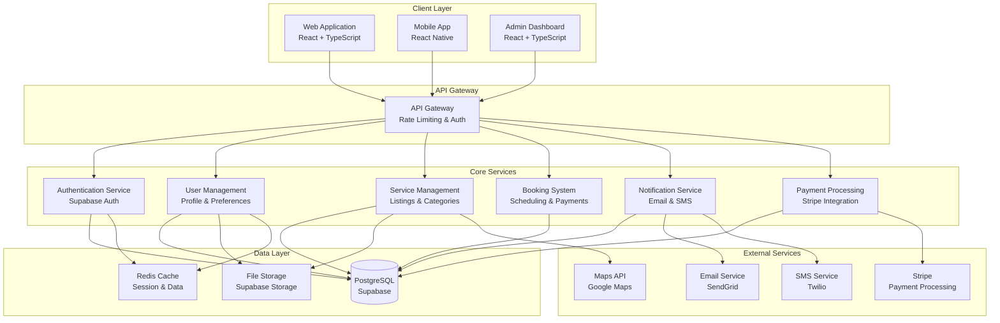

---

## 🗄️ Database Schema

### Core Tables and Relationships

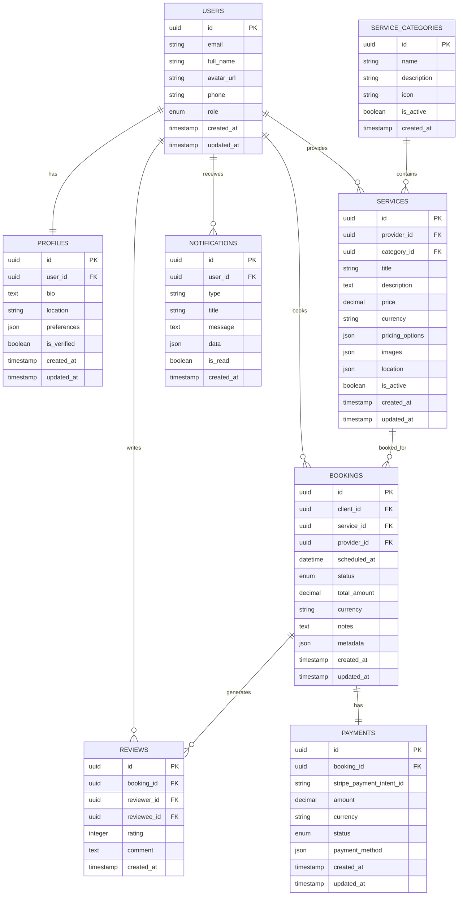

---

## 🔄 API Flow Diagram

### Request Flow and Data Processing

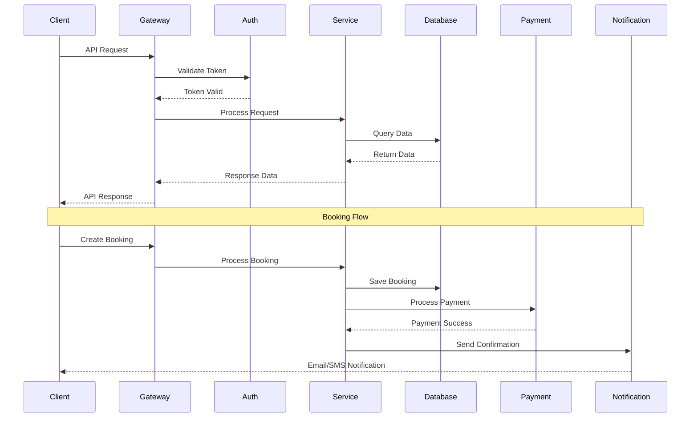

---

## 🔒 Security Architecture

### Authentication and Authorization Flow

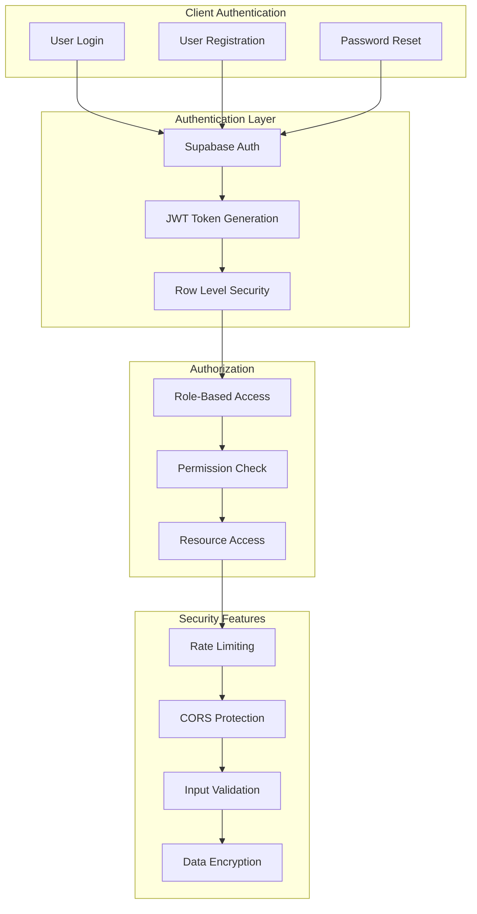

---

## 👤 User Journey Flow

### Complete User Experience Flow

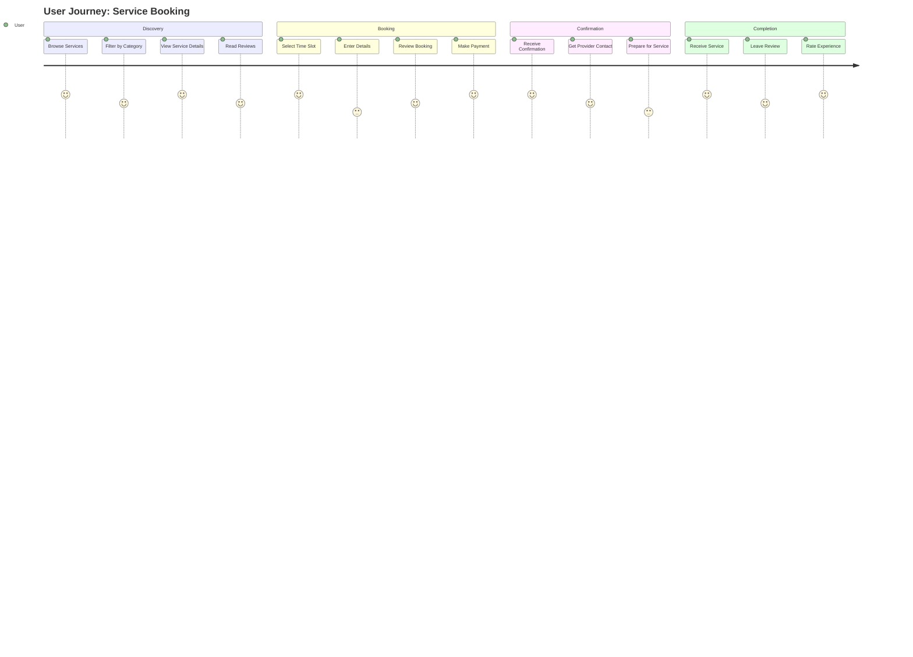

---

## 🚀 Deployment Architecture

### Production Environment Setup

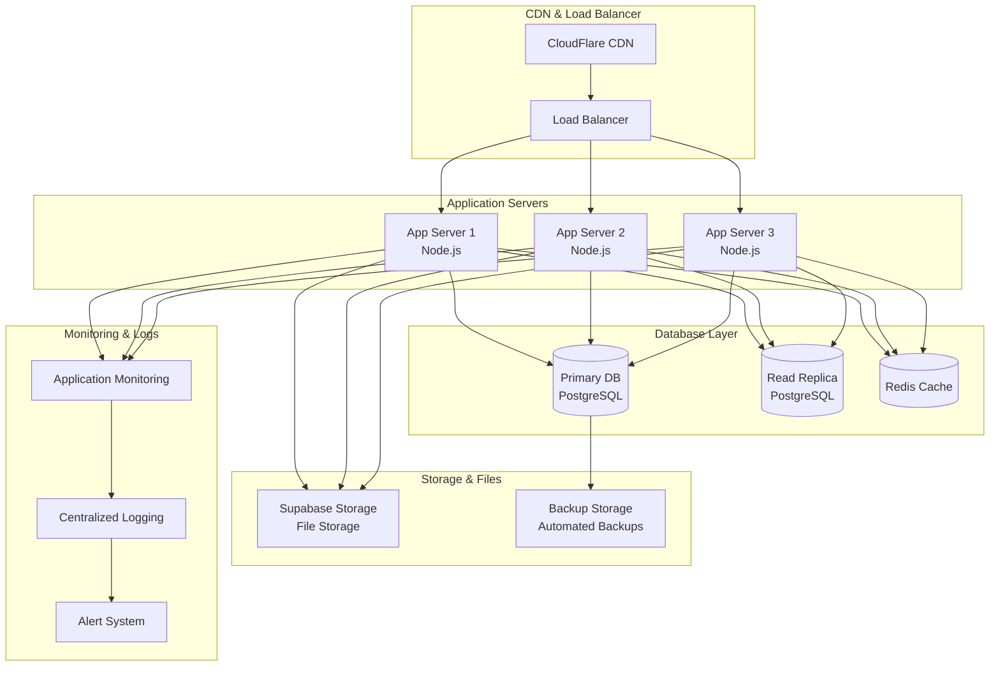

---

## 🧩 Component Architecture

### Frontend Component Structure

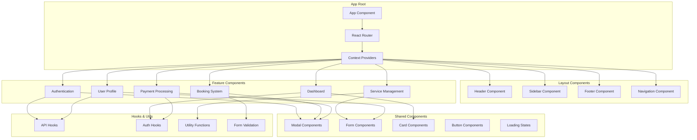

---

## 📊 Performance Architecture

### Caching and Optimization Strategy

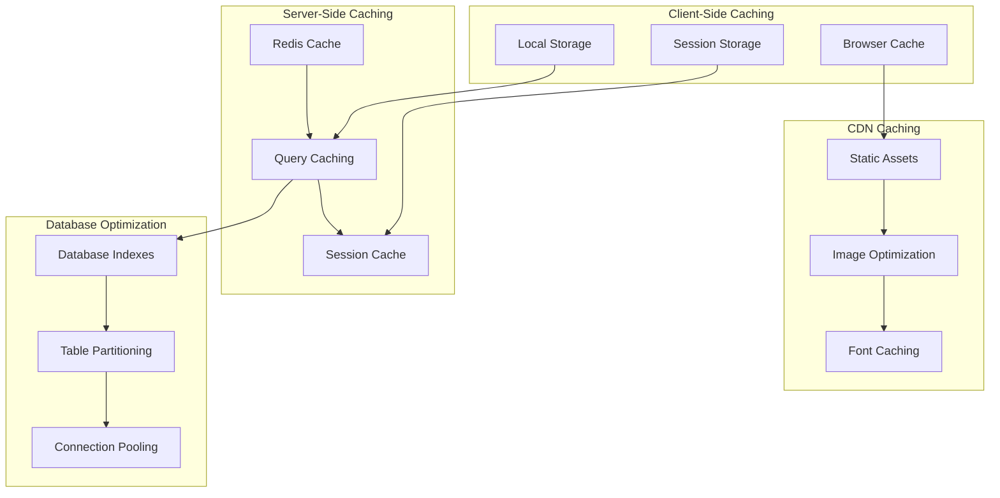

---

## 🔧 Development Architecture

### Local Development Setup

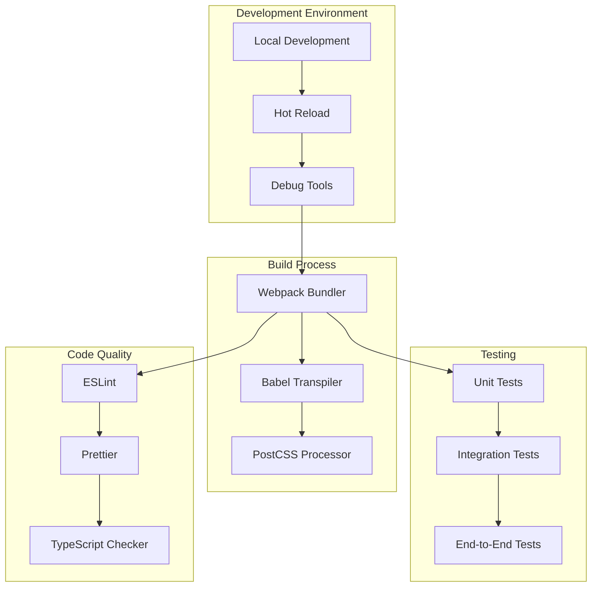

---

## 📈 Monitoring and Analytics

### System Monitoring Architecture

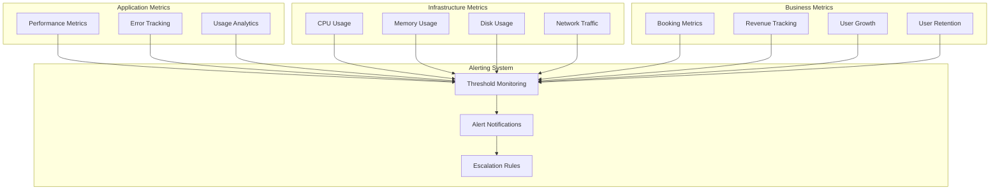

---

## 🎯 Key Architecture Principles

### Design Patterns and Best Practices

1. **Microservices Architecture**: Modular, scalable service design
2. **Event-Driven Architecture**: Asynchronous communication between services
3. **CQRS Pattern**: Command Query Responsibility Segregation
4. **Repository Pattern**: Data access abstraction
5. **Dependency Injection**: Loose coupling and testability
6. **Circuit Breaker**: Fault tolerance and resilience
7. **Rate Limiting**: API protection and resource management
8. **Caching Strategy**: Multi-layer caching for performance
9. **Security by Design**: Built-in security at every layer
10. **Observability**: Comprehensive monitoring and logging

---

## 🔄 Data Flow Patterns

### Request Processing Flow

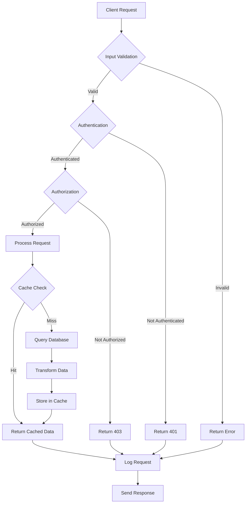

---

This comprehensive architecture documentation provides a complete visual and technical overview of the Business Services Hub system, covering all aspects from high-level system design to detailed component relationships and data flows.
