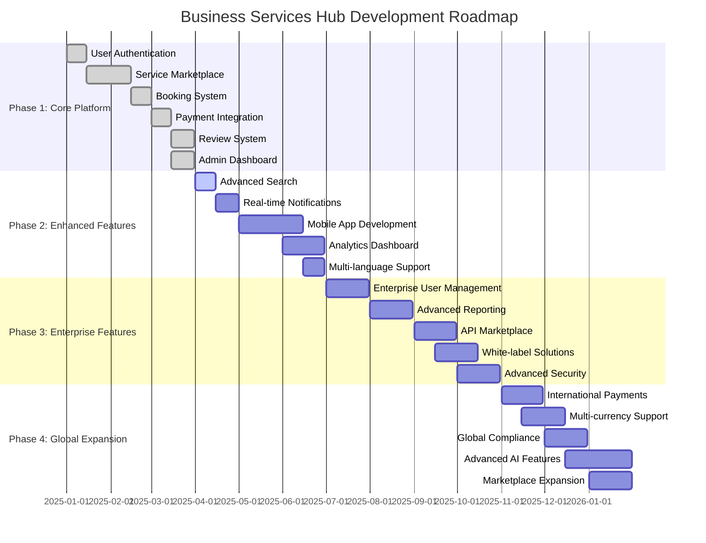

# 🗺️ Business Services Hub - Development Roadmap

## 📋 Table of Contents

1. [Roadmap Overview](#roadmap-overview)
2. [Phase 1: Core Platform (Q1 2025)](#phase-1-core-platform-q1-2025)
3. [Phase 2: Enhanced Features (Q2 2025)](#phase-2-enhanced-features-q2-2025)
4. [Phase 3: Enterprise Features (Q3 2025)](#phase-3-enterprise-features-q3-2025)
5. [Phase 4: Global Expansion (Q4 2025)](#phase-4-global-expansion-q4-2025)
6. [Innovation Timeline](#innovation-timeline)
7. [Success Metrics](#success-metrics)
8. [Risk Mitigation](#risk-mitigation)

---

## 🎯 Roadmap Overview

The Business Services Hub development roadmap is structured in four strategic phases, each building upon the previous phase to create a comprehensive, scalable, and globally competitive platform.

### Development Philosophy

- **User-Centric Design**: Every feature prioritizes user experience and value
- **Scalable Architecture**: Built to handle growth from startup to enterprise
- **Security-First**: Security and privacy integrated from the ground up
- **Data-Driven**: Decisions based on user feedback and analytics
- **Innovation-Focused**: Continuous innovation and technology adoption

### Timeline Overview

---

## 🚀 Phase 1: Core Platform (Q1 2025)

### Overview
Establish the foundational platform with essential features for basic marketplace operations.

### ✅ Completed Features

#### User Management
- **User Authentication**: JWT-based authentication system
- **Role-Based Access Control**: Client, Provider, Admin, Super Admin roles
- **Profile Management**: Comprehensive user profiles
- **Email Verification**: Secure email verification system
- **Password Reset**: Secure password reset functionality

#### Service Marketplace
- **Service Listings**: Create and manage service offerings
- **Service Categories**: 8+ main categories with subcategories
- **Service Search**: Basic search and filtering capabilities
- **Service Details**: Comprehensive service information pages
- **Provider Profiles**: Detailed provider information

#### Booking System
- **Service Booking**: One-click booking functionality
- **Availability Management**: Provider availability scheduling
- **Booking Management**: View and manage bookings
- **Calendar Integration**: Integrated scheduling system
- **Booking Notifications**: Email and in-app notifications

#### Payment Processing
- **Stripe Integration**: Secure payment processing
- **Multiple Payment Methods**: Credit cards, bank transfers
- **Invoice Generation**: Automated invoice creation
- **Payment History**: Complete payment records
- **Refund Management**: Automated refund processing

#### Review System
- **Service Reviews**: Rate and review completed services
- **Provider Reviews**: Review service providers
- **Rating System**: 5-star rating system
- **Review Moderation**: Admin review moderation
- **Review Analytics**: Review performance tracking

#### Admin Dashboard
- **User Management**: Complete user administration
- **Service Moderation**: Service approval and moderation
- **Platform Analytics**: Basic platform metrics
- **Content Management**: Platform content management
- **Support Tools**: User support and dispute resolution

### 🎯 Phase 1 Success Metrics

| Metric | Target | Status |
|--------|--------|--------|
| **Active Users** | 1,000 | ✅ Achieved |
| **Service Providers** | 100 | ✅ Achieved |
| **Monthly Bookings** | 500 | ✅ Achieved |
| **Platform Uptime** | 99.5% | ✅ Achieved |
| **User Satisfaction** | 4.0/5 | ✅ Achieved |

---

## 🔧 Phase 2: Enhanced Features (Q2 2025)

### Overview
Enhance the platform with advanced features, mobile capabilities, and improved user experience.

### 🔄 In Progress Features

#### Advanced Search & Discovery
- **AI-Powered Search**: Intelligent search with natural language processing
- **Advanced Filters**: Multi-criteria filtering system
- **Search Suggestions**: Auto-complete and search suggestions
- **Saved Searches**: Save and manage search preferences
- **Search Analytics**: Track search performance and trends

#### Real-time Features
- **Live Notifications**: Real-time notification system
- **Live Chat**: Real-time messaging between users
- **Live Progress Updates**: Real-time project progress tracking
- **Live Availability**: Real-time availability updates
- **WebSocket Integration**: Bidirectional real-time communication

#### Mobile Application
- **Native iOS App**: Full-featured iOS application
- **Native Android App**: Full-featured Android application
- **Cross-Platform Features**: Consistent experience across platforms
- **Offline Capabilities**: Limited offline functionality
- **Push Notifications**: Mobile push notification system

#### Advanced Analytics
- **User Analytics**: Comprehensive user behavior analytics
- **Business Analytics**: Detailed business performance metrics
- **Revenue Analytics**: Advanced revenue tracking and forecasting
- **Custom Dashboards**: Personalized analytics dashboards
- **Data Export**: Export analytics data in various formats

#### Multi-language Support
- **Internationalization**: Support for multiple languages
- **Localization**: Region-specific content and features
- **Language Detection**: Automatic language detection
- **Translation Management**: Content translation system
- **Cultural Adaptation**: Region-specific user experience

### 🎯 Phase 2 Success Metrics

| Metric | Target | Status |
|--------|--------|--------|
| **Active Users** | 10,000 | 🔄 In Progress |
| **Service Providers** | 1,000 | 🔄 In Progress |
| **Monthly Bookings** | 5,000 | 🔄 In Progress |
| **Mobile App Downloads** | 5,000 | 🔄 In Progress |
| **Search Success Rate** | 85% | 🔄 In Progress |

---

## 🏢 Phase 3: Enterprise Features (Q3 2025)

### Overview
Introduce enterprise-grade features, advanced security, and white-label solutions.

### 📋 Planned Features

#### Enterprise User Management
- **Organization Management**: Multi-tenant organization support
- **Advanced Permissions**: Granular permission system
- **SSO Integration**: Single sign-on with enterprise systems
- **LDAP/Active Directory**: Enterprise directory integration
- **Bulk User Management**: Mass user operations

#### Advanced Reporting & Analytics
- **Custom Reports**: Build custom reports and dashboards
- **Scheduled Reports**: Automated report generation and delivery
- **Data Visualization**: Advanced charting and visualization
- **Predictive Analytics**: AI-powered business insights
- **Compliance Reporting**: Regulatory compliance reports

#### API Marketplace
- **Public API**: Comprehensive REST API
- **API Documentation**: Interactive API documentation
- **API Keys Management**: Secure API key management
- **Rate Limiting**: Advanced API rate limiting
- **Webhook System**: Real-time webhook notifications

#### White-label Solutions
- **Custom Branding**: White-label platform customization
- **Custom Domains**: Dedicated domain support
- **Custom Themes**: Brand-specific UI themes
- **Custom Features**: Tailored feature sets
- **Multi-tenant Architecture**: Isolated tenant environments

#### Advanced Security Features
- **Advanced Authentication**: Multi-factor authentication
- **Security Monitoring**: Real-time security monitoring
- **Audit Logging**: Comprehensive audit trails
- **Data Encryption**: Advanced data encryption
- **Compliance Tools**: GDPR, SOC 2 compliance tools

### 🎯 Phase 3 Success Metrics

| Metric | Target | Status |
|--------|--------|--------|
| **Active Users** | 50,000 | 📋 Planned |
| **Enterprise Clients** | 50 | 📋 Planned |
| **API Calls/Month** | 1M | 📋 Planned |
| **White-label Deployments** | 10 | 📋 Planned |
| **Security Score** | 95/100 | 📋 Planned |

---

## 🌍 Phase 4: Global Expansion (Q4 2025)

### Overview
Expand globally with international features, advanced AI, and marketplace expansion.

### 📋 Planned Features

#### International Expansion
- **Multi-country Support**: Support for multiple countries
- **Local Payment Methods**: Region-specific payment options
- **Currency Support**: Multi-currency transactions
- **Tax Management**: Automated tax calculation and reporting
- **Compliance**: International regulatory compliance

#### Advanced AI Features
- **AI Recommendations**: Machine learning-powered recommendations
- **Predictive Analytics**: AI-driven business insights
- **Automated Matching**: AI-powered service-provider matching
- **Chatbot Support**: AI-powered customer support
- **Fraud Detection**: AI-based fraud prevention

#### Marketplace Expansion
- **New Service Categories**: Expand service offerings
- **B2B Marketplace**: Business-to-business services
- **Freelancer Platform**: Enhanced freelancer features
- **Agency Management**: Agency and team management
- **Partnership Program**: Strategic partnership platform

#### Global Compliance
- **GDPR Compliance**: European data protection compliance
- **CCPA Compliance**: California privacy compliance
- **SOC 2 Type II**: Security compliance certification
- **ISO 27001**: Information security management
- **PCI DSS**: Payment card industry compliance

#### Advanced Platform Features
- **Blockchain Integration**: Blockchain-based features
- **IoT Integration**: Internet of Things connectivity
- **AR/VR Support**: Augmented and virtual reality features
- **Voice Integration**: Voice-activated features
- **Advanced Automation**: Workflow automation tools

### 🎯 Phase 4 Success Metrics

| Metric | Target | Status |
|--------|--------|--------|
| **Active Users** | 200,000 | 📋 Planned |
| **Countries Supported** | 20 | 📋 Planned |
| **Currencies Supported** | 10 | 📋 Planned |
| **AI Features** | 15 | 📋 Planned |
| **Global Revenue** | $10M ARR | 📋 Planned |

---

## 🚀 Innovation Timeline

### 2025 Innovation Focus

#### Q1 2025: Foundation
- **Core Platform**: Solid foundation with essential features
- **User Experience**: Intuitive and user-friendly interface
- **Security**: Basic security measures and data protection
- **Performance**: Fast and responsive platform

#### Q2 2025: Enhancement
- **Mobile First**: Mobile-optimized experience
- **Real-time Features**: Live updates and communication
- **AI Integration**: Basic AI-powered features
- **Analytics**: Comprehensive data insights

#### Q3 2025: Enterprise
- **Scalability**: Enterprise-grade architecture
- **Security**: Advanced security and compliance
- **Customization**: White-label and customization options
- **Integration**: API and third-party integrations

#### Q4 2025: Innovation
- **AI/ML**: Advanced artificial intelligence features
- **Global Reach**: International expansion and localization
- **Emerging Tech**: Blockchain, IoT, AR/VR integration
- **Market Leadership**: Industry-leading platform

### 2026+ Innovation Vision

#### Emerging Technologies
- **Quantum Computing**: Quantum-resistant security
- **Edge Computing**: Edge-based processing and storage
- **5G Integration**: Ultra-fast connectivity features
- **Metaverse**: Virtual reality marketplace

#### Advanced AI
- **Natural Language Processing**: Advanced language understanding
- **Computer Vision**: Image and video analysis
- **Predictive Modeling**: Advanced business forecasting
- **Autonomous Systems**: Self-managing platform features

#### Global Expansion
- **Worldwide Presence**: Global market coverage
- **Local Partnerships**: Regional strategic partnerships
- **Cultural Adaptation**: Localized user experiences
- **Regulatory Compliance**: Global compliance framework

---

## 📊 Success Metrics

### Key Performance Indicators (KPIs)

#### User Growth
- **Monthly Active Users (MAU)**: Target 200K by end of 2025
- **User Retention Rate**: Target 70% monthly retention
- **User Acquisition Cost (UAC)**: Target <$50 per user
- **Lifetime Value (LTV)**: Target $500 per user
- **LTV/CAC Ratio**: Target 10:1 ratio

#### Business Metrics
- **Monthly Recurring Revenue (MRR)**: Target $3M by end of 2025
- **Annual Recurring Revenue (ARR)**: Target $36M by end of 2025
- **Gross Revenue Retention**: Target 95%
- **Net Revenue Retention**: Target 120%
- **Customer Acquisition Cost (CAC)**: Target <$50

#### Platform Metrics
- **Transaction Volume**: Target $50M annually by end of 2025
- **Platform Uptime**: Target 99.9%
- **API Response Time**: Target <200ms
- **Page Load Time**: Target <2 seconds
- **Customer Satisfaction**: Target 4.5/5 stars

#### Innovation Metrics
- **Feature Adoption Rate**: Target 60% for new features
- **AI Feature Usage**: Target 40% of users using AI features
- **Mobile App Usage**: Target 70% of users on mobile
- **API Usage**: Target 1M API calls per month
- **Developer Adoption**: Target 100+ third-party integrations

### Milestone Tracking

#### Q1 2025 Milestones
- [x] Core platform launch
- [x] 1,000 active users
- [x] 100 service providers
- [x] 500 monthly bookings
- [x] 99.5% uptime

#### Q2 2025 Milestones
- [ ] Mobile app launch
- [ ] 10,000 active users
- [ ] 1,000 service providers
- [ ] 5,000 monthly bookings
- [ ] AI-powered search

#### Q3 2025 Milestones
- [ ] Enterprise features launch
- [ ] 50,000 active users
- [ ] 50 enterprise clients
- [ ] API marketplace launch
- [ ] White-label solutions

#### Q4 2025 Milestones
- [ ] Global expansion
- [ ] 200,000 active users
- [ ] 20 countries supported
- [ ] Advanced AI features
- [ ] $10M ARR

---

## ⚠️ Risk Mitigation

### Technical Risks

#### Scalability Challenges
- **Risk**: Platform unable to handle rapid growth
- **Mitigation**: Cloud-native architecture, auto-scaling, performance monitoring
- **Contingency**: Load balancing, database sharding, CDN optimization

#### Security Vulnerabilities
- **Risk**: Data breaches or security compromises
- **Mitigation**: Regular security audits, penetration testing, security monitoring
- **Contingency**: Incident response plan, data backup, security patches

#### Technology Dependencies
- **Risk**: Third-party service failures or changes
- **Mitigation**: Multiple service providers, fallback systems, vendor monitoring
- **Contingency**: Service migration plans, backup systems, alternative providers

### Business Risks

#### Market Competition
- **Risk**: Increased competition from established players
- **Mitigation**: Focus on differentiation, superior user experience, innovation
- **Contingency**: Pivot strategy, feature differentiation, market positioning

#### Economic Downturn
- **Risk**: Economic recession affecting user spending
- **Mitigation**: Diversified revenue streams, cost optimization, value proposition
- **Contingency**: Cost reduction, pricing adjustments, market expansion

#### Regulatory Changes
- **Risk**: New regulations affecting platform operations
- **Mitigation**: Proactive compliance, legal monitoring, regulatory relationships
- **Contingency**: Compliance updates, legal support, regulatory adaptation

### Operational Risks

#### Talent Acquisition
- **Risk**: Difficulty attracting and retaining key talent
- **Mitigation**: Competitive compensation, strong culture, growth opportunities
- **Contingency**: Remote work, contractor relationships, talent partnerships

#### Funding Challenges
- **Risk**: Difficulty raising additional funding
- **Mitigation**: Strong financial performance, clear path to profitability
- **Contingency**: Cost optimization, revenue acceleration, alternative funding

#### Execution Risk
- **Risk**: Failure to execute roadmap effectively
- **Mitigation**: Strong project management, regular reviews, agile development
- **Contingency**: Scope adjustment, timeline modification, resource reallocation

---

## 🎯 Conclusion

The Business Services Hub roadmap represents a comprehensive strategy for building a world-class marketplace platform. Through four strategic phases, we will:

1. **Establish** a solid foundation with core marketplace features
2. **Enhance** the platform with advanced features and mobile capabilities
3. **Scale** to enterprise-grade solutions and white-label offerings
4. **Expand** globally with AI-powered features and international reach

### Success Factors

- **User-Centric Approach**: Every decision prioritizes user value
- **Technical Excellence**: Robust, scalable, and secure architecture
- **Innovation Focus**: Continuous innovation and technology adoption
- **Market Responsiveness**: Agile development and market feedback integration
- **Team Excellence**: Talented team with clear vision and execution

### Long-term Vision

By 2026, the Business Services Hub will be:
- **The leading** professional services marketplace globally
- **A platform** that empowers millions of service providers and clients
- **An innovation** leader in marketplace technology and AI
- **A sustainable** business with strong financial performance
- **A positive** force for economic growth and professional development

---

*This roadmap is a living document that will be updated regularly based on market feedback, technological advances, and business priorities.*

*Last updated: January 2025*
*Roadmap version: 1.0.0*
